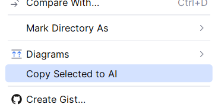
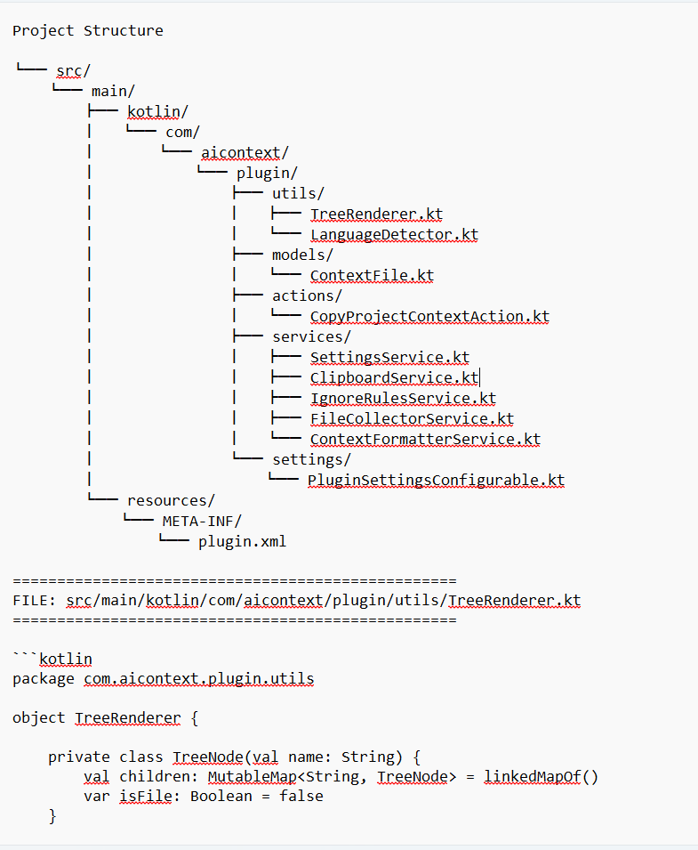

# Copy Project Context for AI

[](LICENSE)

A universal JetBrains IDE plugin that copies selected project files and folders into an AI-friendly format for ChatGPT, Claude, Gemini, Cursor, Continue, Aider, and other LLM tools.

## Project Overview

Developers frequently need to share project context with AI assistants. Manually copying file trees and contents is slow, error-prone, and often includes irrelevant build artifacts.

**Copy Project Context for AI** solves this by generating a structured document from your current Project View selection, including:

- repository structure tree
- relative file paths
- exact file contents
- language-aware markdown code blocks

The plugin is language-agnostic and uses only IntelliJ Platform APIs (`VirtualFile`, `Project`, clipboard, notifications, etc.), so it works consistently across JetBrains IDEs.

### Supported JetBrains IDEs

- IntelliJ IDEA
- PyCharm
- WebStorm
- GoLand
- PhpStorm
- CLion
- RustRover
- RubyMine
- DataGrip

### Supported Operating Systems

- Windows
- macOS
- Linux

Any OS supported by the IntelliJ Platform and your chosen JetBrains IDE.

## Features

- Copy selected files from Project View
- Copy selected folders recursively
- Mixed file/folder multi-selection support
- Project tree generation with ASCII diagram
- AI-friendly output formatting
- Clipboard integration
- `.gitignore` support
- Additional ignore file support (`.cursorignore`, `.aiderignore`, `.copilotignore`)
- Built-in ignore rules for common build/dependency/binary paths
- Settings page for limits and exclusions
- Large project protection with Continue/Cancel prompts
- Deterministic alphabetical output ordering

## Installation

### From Source

1. Clone the repository:

```bash
git clone https://github.com/example/copy-project-context-for-ai.git
cd copy-project-context-for-ai
```

2. Open the project in IntelliJ IDEA (2024.2+ recommended).

3. Build the plugin:

```bash
./gradlew build
```

Windows:

```powershell
.\gradlew.bat build
```

4. Run the IntelliJ sandbox with the plugin loaded:

```bash
./gradlew runIde
```

5. Build a distributable plugin ZIP:

```bash
./gradlew buildPlugin
```

The ZIP is created in `build/distributions/`.

## Installing Plugin ZIP

1. Open your JetBrains IDE.
2. Go to **Settings** (or **Preferences** on macOS) → **Plugins**.
3. Click the gear icon → **Install Plugin from Disk...**
4. Select the generated ZIP from `build/distributions/`.
5. Restart the IDE.

## Usage

1. Open a project in your JetBrains IDE.
2. In the Project View, select one or more files and/or folders.
3. Right-click the selection.
4. Choose **Copy Project Context for AI**.
5. Paste the generated output into ChatGPT, Claude, Gemini, Cursor, Continue, Aider, or any LLM tool.

### Screenshots

Context menu:



Example output:



> Add screenshots to `docs/images/` for publication.

## Example Output

See [docs/example-output.md](docs/example-output.md) for a full sample.

Short excerpt:

~~~
Project Structure

src/
├── main/
│   └── java/
│       └── App.java
└── test/
    └── AppTest.java

==================================================
FILE: src/main/java/App.java
==================================================

```java
public class App {
    public static void main(String[] args) {
        System.out.println("Hello");
    }
}
```
~~~

## Configuration

Open **Settings → Tools → Copy Project Context for AI**.

| Setting | Default | Description |
|---------|---------|-------------|
| Maximum files | `1000` | Soft limit for selected/exported files. Prompts before proceeding when exceeded. |
| Maximum characters | `5000000` | Soft limit for generated output size. Prompts before copying when exceeded. |
| Maximum single file size | `500000` | Files larger than this are skipped. |
| Excluded directories | `.idea`, `.git`, `node_modules`, ... | Directory names excluded during traversal. |
| Excluded extensions | `png`, `jar`, `class`, ... | File extensions excluded from export. |
| Include project tree | `true` | Include ASCII project structure section. |
| Include file contents | `true` | Include file content code blocks. |

Settings are persisted using IntelliJ `PersistentStateComponent`.

## Ignore Rules

The plugin never exports files excluded by:

### Built-in defaults

Directories:

- `.idea`, `.git`, `.gradle`, `build`, `out`, `target`, `dist`, `coverage`, `node_modules`, `vendor`

Files/extensions:

- `*.class`, `*.jar`, `*.war`, `*.ear`, `*.log`, `*.tmp`, `*.lock`, `.DS_Store`
- Binary/media/archive extensions such as `png`, `jpg`, `pdf`, `zip`, `exe`, `dll`, etc.

### Ignore files

The plugin reads and applies:

- `.gitignore`
- `.cursorignore`
- `.aiderignore`
- `.copilotignore`

Example `.gitignore`:

```gitignore
# Build output
/target/
/dist/

# Local env files
.env
.env.local

# Logs
*.log
```

Example `.cursorignore`:

```gitignore
legacy/
generated/
```

Ignored paths are resolved relative to the project root and to the directory containing each ignore file.

## Performance Notes

- Large repositories can produce very large clipboard payloads.
- Default limits help prevent accidental exports of thousands of files or multi-megabyte prompts.
- Single files above the configured size are skipped automatically.
- When limits are exceeded, a confirmation dialog offers **Continue** or **Cancel**.
- Collection runs in a background task to keep the IDE responsive.
- Memory usage scales with total exported content size.

## Development

### Project Structure

```
src/main/kotlin/com/aicontext/plugin/
├── actions/      # IDE actions (context menu entry point)
├── services/     # Core logic (collection, ignore rules, formatting, clipboard, settings)
├── models/       # Data classes
├── settings/     # Settings UI
└── utils/        # Tree rendering and language detection
```

Detailed docs:

- [Architecture](docs/architecture.md)
- [Development Guide](docs/development.md)
- [Contributing](CONTRIBUTING.md)

## Building

```bash
./gradlew build
./gradlew runIde
./gradlew verifyPlugin
```

Build plugin ZIP:

```bash
./gradlew buildPlugin
```

## Compatibility

- IntelliJ Platform baseline: `2024.2.5`
- Since build: `242`
- Module dependency: `com.intellij.modules.platform`

Compatible IDEs include:

- IntelliJ IDEA
- PyCharm
- WebStorm
- GoLand
- PhpStorm
- CLion
- RustRover
- RubyMine
- DataGrip

## License

This project is licensed under the MIT License. See [LICENSE](LICENSE) for details.

## Changelog

See [CHANGELOG.md](CHANGELOG.md).
