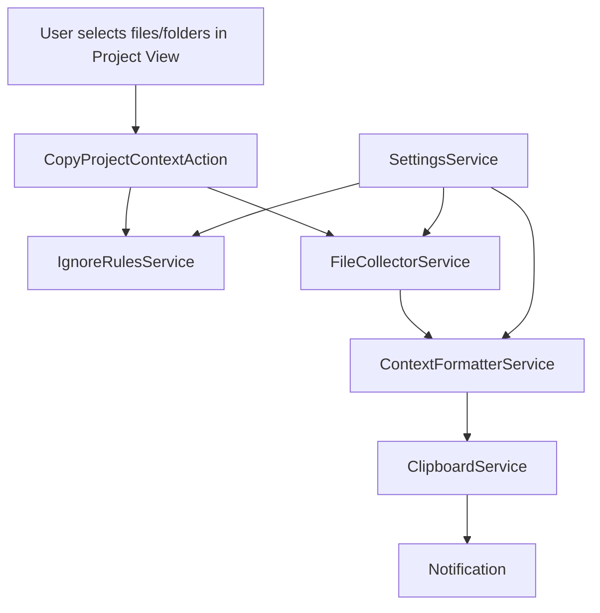

# Architecture

This document describes the architecture of the **Copy Project Context for AI** IntelliJ Platform plugin.

## Goals

- Work across all JetBrains IDEs built on the IntelliJ Platform
- Remain language-agnostic (no Java/Kotlin/Python PSI dependencies)
- Produce deterministic, AI-friendly output
- Respect ignore rules and user-configured limits

## High-Level Flow



## Package Responsibilities

### `actions`

Contains IDE entry points.

- `CopyProjectContextAction`
  - Registers in Project View context menu
  - Validates project and selection state
  - Runs collection/formatting in a background task
  - Shows limit confirmation dialogs
  - Displays success/failure notifications

### `services`

Contains core business logic.

- `SettingsService`
  - Application-level persistent settings (`PersistentStateComponent`)
  - Exposes limits, exclusions, and output toggles

- `IgnoreRulesService`
  - Applies default excluded directories/extensions
  - Loads and evaluates `.gitignore`, `.cursorignore`, `.aiderignore`, `.copilotignore`
  - Uses gitignore-style pattern matching

- `FileCollectorService`
  - Traverses selected files/folders recursively
  - Resolves project-relative paths
  - Skips ignored, duplicate, symlink, and oversized files
  - Reads file content as UTF-8 text

- `ContextFormatterService`
  - Builds final export document
  - Renders optional project tree
  - Formats file sections with markdown code fences

- `ClipboardService`
  - Writes generated text to the system clipboard

### `models`

- `ContextFile`
  - Represents one exported file (`relativePath`, `content`, `language`)

### `settings`

- `PluginSettingsConfigurable`
  - Settings UI under **Tools → Copy Project Context for AI**
  - Reads/writes `SettingsService`

### `utils`

- `LanguageDetector`
  - Maps file names/extensions to markdown language identifiers

- `TreeRenderer`
  - Builds ASCII tree from exported relative paths

## Data Flow Details

1. **Selection**
   - Action reads `CommonDataKeys.VIRTUAL_FILE_ARRAY` from the Project View context.

2. **Pre-check**
   - `FileCollectorService.countEligibleFiles(...)` estimates final file count.
   - If count exceeds `maxFiles`, user is prompted to continue or cancel.

3. **Collection**
   - Each selected node is traversed depth-first.
   - Default excluded directories are not entered.
   - Ignore files are evaluated against project-relative paths.
   - Regular files are sorted via `TreeSet` for deterministic ordering.

4. **Formatting**
   - Optional tree section includes only exported files.
   - Each file section uses:
     - separator line
     - `FILE: relative/path`
     - fenced code block with detected language

5. **Post-check**
   - If output size exceeds `maxCharacters`, user is prompted again.

6. **Clipboard + Notification**
   - Clipboard receives full generated text.
   - Notification reports file count and character count.

## Ignore Rule Evaluation

Ignore evaluation combines:

1. **Hard directory exclusions** (e.g., `node_modules`, `.git`)
2. **Extension and filename exclusions** (e.g., `png`, `.DS_Store`)
3. **Ignore files** discovered in the project tree

Ignore file semantics follow common gitignore behavior:

- comments (`#...`) are ignored
- `!` negates a previous match
- trailing `/` marks directory-only patterns
- leading `/` anchors pattern to ignore file directory
- `*` and `**` wildcards are supported

## Persistence

`SettingsService` stores settings in `copyProjectContext.xml` via IntelliJ platform persistence.

Defaults:

- `MAX_FILES = 1000`
- `MAX_CHARACTERS = 5_000_000`
- `MAX_SINGLE_FILE_SIZE = 500_000`

## Error Handling

- Exceptions in the action are logged and surfaced via error notifications.
- File read failures are logged; individual files may be skipped with a log entry.
- Large single files are skipped based on configured size limits.

## Compatibility Constraints

The plugin depends only on:

```xml
<depends>com.intellij.modules.platform</depends>
```

This ensures compatibility with IntelliJ IDEA, PyCharm, WebStorm, GoLand, PhpStorm, CLion, RustRover, RubyMine, DataGrip, and other IntelliJ Platform distributions.
